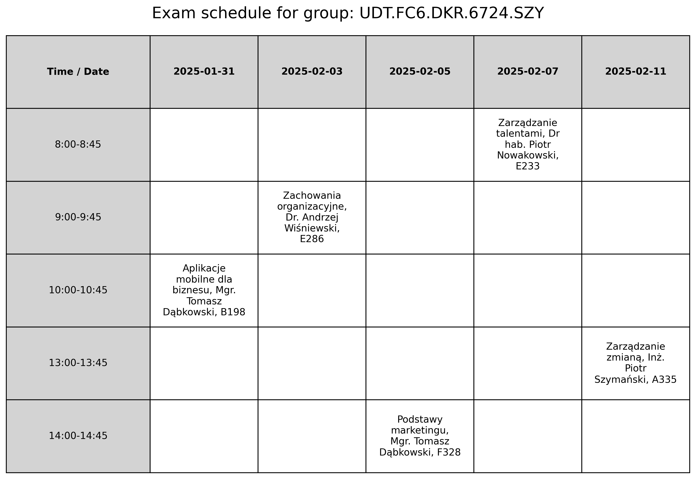

# Exam Scheduling Program

## About

The **Exam Scheduling Program** is a Python-based application designed to create efficient and conflict-free exam schedules for universities. By leveraging graph coloring algorithms, the program ensures:

- No two exams with overlapping participants are scheduled simultaneously.
- Each group has only one exam per day.
- Exams are not scheduled on weekends.

The schedule is saved as a CSV file, and optional visualizations in the form of tables can be generated for students, saved as PNG images.

## Features

- **Conflict-free scheduling** using graph coloring algorithms.
- **Customizable exam times** and start dates.
- **Support for CSV datasets** containing exam and participant data.
- **Weekend exclusion** to ensure exams are scheduled only on weekdays.
- **Visualized schedules** for students, saved as PNG files.

---

## Installation

### Prerequisites

Make sure you have Python 3.8 or higher installed on your system.

### Steps

1. Clone the repository:

   ```bash
   git clone https://github.com/radosz365/ExamScheduling.git
   cd ExamScheduling
   ```
2. Create a virtual environment:

   #### On macOS/Linux:


   ```bash
   python3 -m venv venv
   source venv/bin/activate
   ```

   #### On Windows:

   ```bash
   python -m venv venv
   .\venv\Scripts\activate
   ```
3. Install the dependencies:

   ```bash
   pip install -r requirements.txt
   ```

---

## Usage

### Default Settings

To run the program with default settings:

```bash
python run.py
```

### Custom Settings

1. Add your dataset:

   - Place your CSV file containing exam and participant data into the `datasets` folder.
2. Edit the `run.py` file:

   - Set the dataset file name:
     ```python
     dataset = "your_dataset.csv"
     ```
   - Configure the start date for exams:
     ```python
     start_date = "YYYY-MM-DD"
     ```
   - Define custom time slots (optional):
     ```python
     time_slots = [
         "8:00-8:45",
         "9:00-9:45",
         "10:00-10:45",
         "11:00-11:45",
         "12:00-12:45",
         "13:00-13:45",
         "14:00-14:45",
         "15:00-15:45",
         "16:00-16:45",
     ]
     ```
3. Run the program:

   ```bash
   python run.py
   ```

### Output

- **Schedule CSV**: Saved in the `schedules` folder.
- **Visualizations**: Saved in the `visualizations` folder as PNG files.

---

### Demo

To generate a schedule visualization, enter the path to the data file in the `run.py` file in the `file_path` variable and enter the group for which you want to generate the visualization in the `group_to_display` variable.

```bash
    file_path = "schedules/your_dataset.csv"
    group_to_display = "the group you want to save in png format"
```

An example visualization:



---

## Documentation

Full code documentation is available [here](https://radosz365.github.io/ExamScheduling/).

---

## Potential Future Improvements

- Generating visualizations for lecturers.
- Adding more graph coloring algorithms.
- Comparing results obtained using different coloring algorithms.
- Implementing visual interfaces for users.

---

## Contact

Developed by:

- [Radosław](https://github.com/radosz365)
- [Wiktor](https://github.com/boltzful)
- [Paweł](https://github.com/IamPawel)

For questions or feedback, feel free to contact any of the authors via GitHub.
